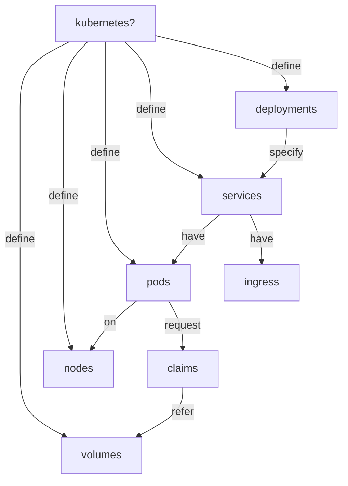

# deontic

Define [Deontic Modality](https://en.wikipedia.org/wiki/Deontic_modality) as 

  "a linguistic modality that indicates how the world ought to be according to certain norms, expectations, ..."

# high availability

Define [High Availability](https://en.wikipedia.org/wiki/High_avalability) as 

  "a characteristic of a system that aims to ensure an agreed level of operational performance, usually uptime, for a higher than normal period."

or as 

  "a property of network resilience, the ability to provide and maintain an acceptable level of service in the face of faults and challenges to normal operation."

  ## cluster 

  Given that we have kubernetes to provide the cluster definitions, consider the following flowchart

