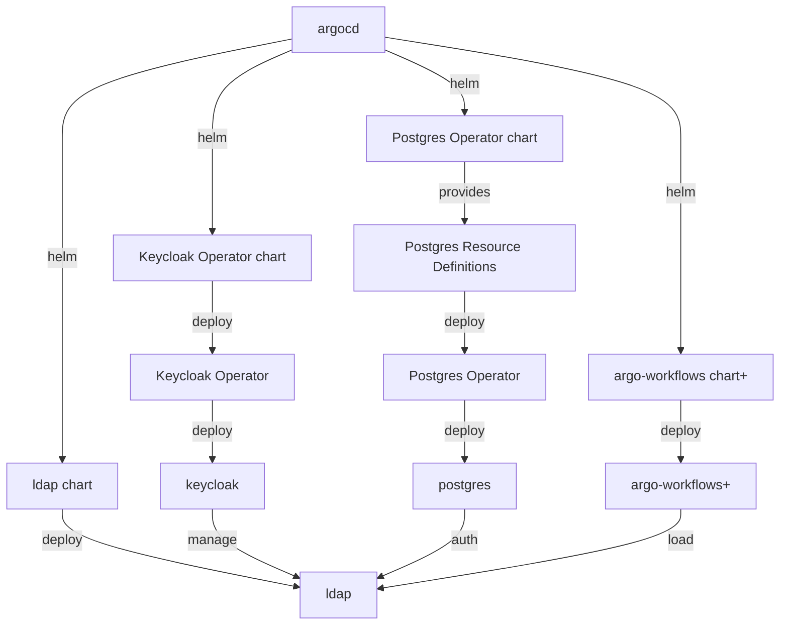

As part of our work as DevOps engineers, we will periodically be required to upgrade a cluster.

A cluster provides mechanisms or facilities to perform operations such as rolling deployments. 
Deployments occur in the context of a graph of dependencies. If we restrict our consideration to 
some subset of the overall cluster components, the number of considerations is reduced.

Consider an example, where *keycloak* is used to manage an *ldap* instance used by a *postgres* 
instance for authentication credentials.

## deployment dependency graph

For the purposes of this discussion, we would consider cluster components such as keycloak and 
ldap as atomic components, realizing that they can be further considered as composite entities.
Further elaboration of a component such as *ldap* will be considered in terms of its constituant 
components in a later section. 

Note, items marked with `+` are recommended.